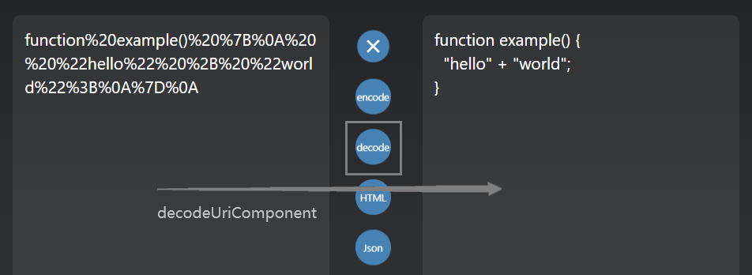

# formatCodeApi

An Api can format java python c# swift php ruby html javascript typescript json vue angular markdown graphql...

## what's this?

这是一个格式化代码的 API ,可以对多种代码类型进行格式化( vue/angular 框架也支持 )

The Api Can Format Those Types Of Code ↓

```formatCodeAPI
//该格式化Api支持的代码/文件后缀/框架类型如下
//this api now supports to format those type of code language

html|javascript|typescript|json|markdown|vue|angular|yaml|graphql
java|python|c#|swift|php|ruby|apex|xml
```

你可以使用 formatCodeApi 在线工具格式化代码 https://aozozo.com
format Code example


## How to use?

使用 POST 发送一段 Http 请求,向服务器获取数据

Use any one language sends a **HTTP request**, use **POST** method with your unformat code, choose the relevant api link to post your HTTP request, put the unformat code ( _String type_ ) in request body, you may need add _contentType: text/plain_.

```js
// example - javascript-AJAX-jqurey
// the example use AJAX to post an http request, you can post http request by other language
$.post({
  url: "http://aozozo.com:600/javascript",
  //contentType 必需
  contentType: "text/plain;charset=utf-8",
  data: "hello",
  success: function (data) {
    //decodeURIComponent 解码后可以得到
    console.log(decodeURIComponent(data));
  },
  error: function (e) {
    console.log(e.status);
  },
});
```

```dart
// example - flutter dependencies: http: ^0.12.1
// the example use flutter to post an http request, you can post http request by other language
String unformatedcode = '''
function example(){"hello"
+"world"}
'''
_postData() async {
    var apiUrl = 'http://aozozo.com:600/javascript';
    var result = await http.post(apiUrl, body: unformatedcode );
    if (result.statusCode == 200) {
      //解码得到格式化后的字符串↓
      print(Uri.decodeComponent(result.body));
    } else {
      print(result.statusCode);
    }
  }

// api返回  function%20example()%20%7B%0A%20%20%22hello%22%20%2B%20%22world%22%3B%0A%7D%0A
// 解码后得到格式化后的字符串↓  to decodeComponentUri the received code

function example() {
  "hello" + "world";
}

```

## you can test api in Postman


use decodeURIComponent code api decode it or use online tool decode it http://aozozo.com



## Api links

Java

```formatCodesApi
http://aozozo.com:600/java
```

Java

```formatCodesApi
http://aozozo.com:600/python
```

Java

```formatCodesApi
http://aozozo.com:600/csharp
```

Java

```formatCodesApi
http://aozozo.com:600/swift
```

PHP

```formatCodesApi
http://aozozo.com:600/php
```

Ruby

```formatCodesApi
http://www.zafuswitchout.com:3001/ruby
```

Apex

```formatCodesApi
http://aozozo.com:600/apex
```

XML

```formatCodesApi
http://aozozo.com:600/xml
```

HTML

```formatCodesApi
http://aozozo.com:600/html
```

JavaScript

```formatCodesApi
http://aozozo.com:600/javascript
```

Typescript

```formatCodesApi
http://aozozo.com:600/typescript
```

JSON

```formatCodesApi
http://aozozo.com:600/json
```

Markdown

```formatCodesApi
http://aozozo.com:600/markdown
```

Vue

```formatCodesApi
http://aozozo.com:600/vue
```

Angular

```formatCodesApi
http://aozozo.com:600/angular
```

Java

```formatCodesApi
http://aozozo.com:600/yaml
```

GraphQL

```formatCodesApi
http://aozozo.com:600/graphql
```

you can use my format code tool online at https://aozozo.com

the format code tool use this api.

## FAQ

### 我没有收到 Api 返回的结果 I received nothing but an error >

状态码 404 => #check link 路径错误

#server maintenance 服务器正在调试

​ 500 => #usually grammar error 大多数情况下是代码格式问题 ( 语法不规范导致的不能转换 )

​ #need add header 添加请求头 contentType:'text/plain;charset=utf-8'
